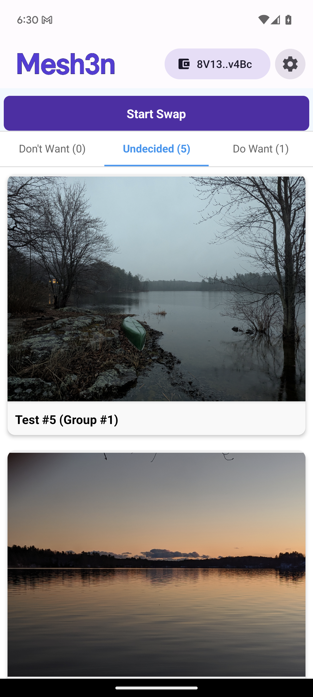
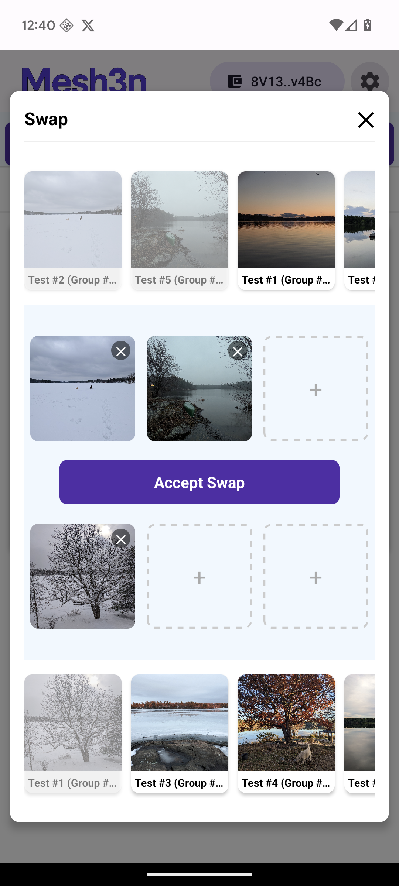
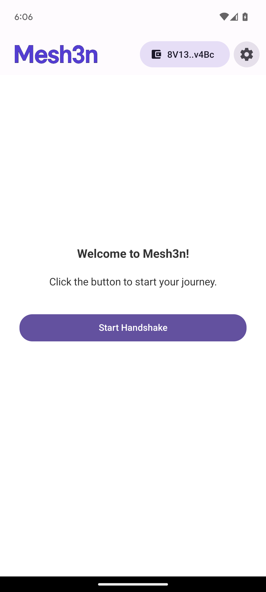

<div align="center">
  
  <p><strong>Peer-to-peer NFT swapping made simple</strong></p>
</div>

<p align="center">
  <a href="#features">Features</a> •
  <a href="#tech-stack">Tech Stack</a> •
  <a href="#installation">Installation</a> •
  <a href="#usage">Usage</a>
</p>

## ✨ Features

- **Secure P2P NFT Swapping** - Trade Solana NFTs directly with other users
- **NFC Handshake** - Establish connections by tapping phones together
- **Real-time Updates** - See partner's selections instantly
- **On-chain Settlement** - All swaps are secured by Solana blockchain
- **Intuitive UI** - Beautiful interface with confetti celebrations on successful swaps

## 🛠️ Tech Stack

- **Frontend**: React Native, Expo, TypeScript
- **Blockchain**: Solana (web3.js, Mobile Wallet Adapter)
- **Communication**: Ably for real-time messaging
- **UI Components**: React Native Paper
- **Navigation**: React Navigation
- **Smart Contract**: Custom Solana escrow program

## 📱 Screenshots

<div align="center">
  <table>
    <tr>
      <td align="center">
        
        <br />
        <em>NFT Gallery</em>
      </td>
      <td align="center">
        
        <br />
        <em>Swap Interface</em>
      </td>
      <td align="center">
        
        <br />
        <em>NFC Handshake</em>
      </td>
    </tr>
  </table>
</div>

## 🚀 Installation

```bash
# Clone the repository
git clone https://github.com/yourusername/mesh3n.git

# Install dependencies
cd mesh3n
npm install

# Start the app
npx expo start
```

## 📖 Usage

1. Connect your Solana wallet
2. Tap phones to establish connection
3. Select NFTs to trade
4. Confirm the swap
5. Celebrate with confetti! 🎉

> **Note**: This app is currently optimized for Android devices